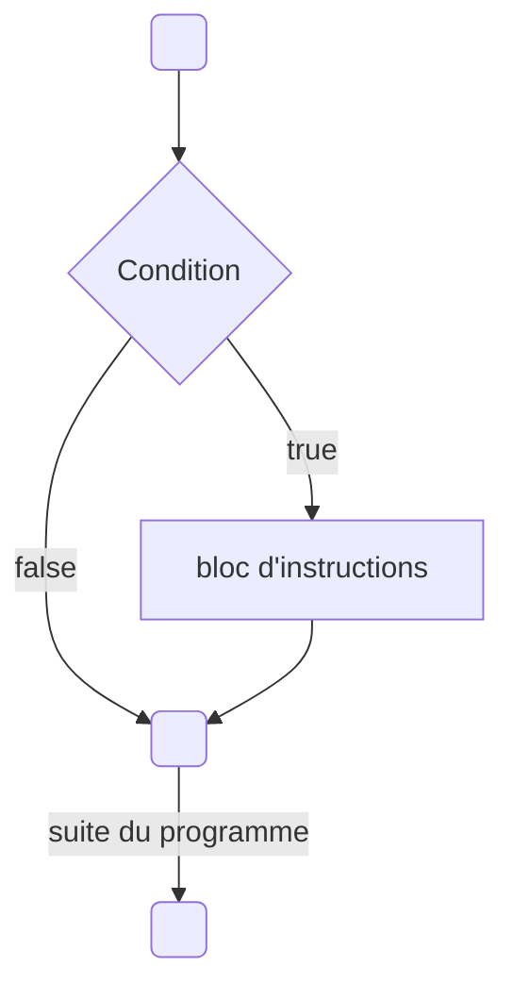

# Introduction

Avec nos variables il va maintenant être intéressant de faire varier notre programme.
Le C++ va nous permettre d'exprimer des **conditions** sur les valeurs de nos variables afin de réaliser des choses différentes.

Ce chapitre va introduire plusieurs outils qui permettent de manipuler les variables et créer 
et c'est doncmaintenant que les **conditions** vont rentrer en jeu.

## Les valeurs booléennes

J'ai omis un type lors du précédant chapitre, il s'agit du **type booléen**, il s'utilise avec le mot clé **bool**.

Ce type peut prendre deux valeurs: soit **true**, signifiant vrai, soit **false** qui veut dire faux. C'est donc idéal pour stocker le résultat d'un conditions.

Voila un petit exemple:

```cpp
int main() {
    bool const condition { true };
    return 0;
}
```

Cela va devenir intéréssant grâce à ce que l'on appel les **opérateurs de comparaison**.

| Opérateur	| Signification	|
|-|-|
| == |	**Égalité**, compare si deux variables sont égales |
| != |	**Inégalité**, compare si deux variables sont différentes |
| <  |	**Strictement inférieur**, compare si la variable de gauche est strictement inférieure à celle de droite |
| <= |	**Inférieur ou égale**, compare si la variable de gauche est inférieure ou égale à celle de droite |
| >  |	**Strictement supérieur**, compare si la variable de gauche est strictement supérieure à celle de droite |
| >= |	**Supérieur ou égale**, compare si la variable de gauche est supérieure ou égale à celle de droite |

Ces opérateurs vont nous permettre de créer des conditions (des valeurs booléennes) à partir de nos autres variables.

```cpp Un petit exemple
#include <iostream>
int main() {
    float const a { 10.0f };
    float const b { 20.0f };

    std::cout << a << " == " << b << " donne " << (a == b) << std::endl;
    std::cout << a << " != " << b << " donne " << (a != b) << std::endl;
    std::cout << a << " < " << b << " donne " << (a < b) << std::endl;
    std::cout << a << " <= " << b << " donne " << (a <= b) << std::endl;

    // On peux aussi stocker le résultat de la condition dans une variable booléenne
    float const price { 24.5f }
    bool const condition { price >= 100.f };

    return 0;
}
```

:::note
Par défaut, std::cout affiche 1 pour une condition vrai(true) ou 0 pour une condition fausse (false).

Il est possible de changer ce comportement en ajoutant un "modificateur" sur le stream **cout**:

```cpp
#include <iostream>
int main() {
    float const a { 10.0f };
    float const b { 20.0f };

    std::cout << std::boolalpha;
    std::cout << a << " == " << b << " donne " << (a == b) << std::endl;

    return 0;
}
```

:::

Vous commencez à voir le potentiel des valeurs booléennes, n'est ce pas ? 


## La logique booléenne

Maintenant que nous disposons d'un moyen d'obtenir une valeur booléenne (via les opérateurs de comparaison) nous allons pouvoir manipuler ces valeurs booléennes avec ce que l'on nomme des **opérateurs logiques**.

Ces opérateurs vons nous permettre de combiner et modifier des valeurs booléennes afin d'en obtenir d'autres et faire ce que l'on appel plus généralement de l’algèbre booléenne.
Mais ne vous inquiété pas, derrière ce nom très mathématique se cache des choses très simple.

### NOT: La négation

l'opérateur **!** (placé devant une valeur booléenne) permet d'exprimer la négation d'une condition.

:::note
C'est ici un opérateur dit **unaire** (qui s'applique sur une seule valeur) et donne en retour la condition inverse.
:::

Voici ce qu’on appelle la **table de vérité** de l’opérateur NOT, qui formalise les entrées et les sorties de cet opérateur. 

| A     | Résultat |
|-------|----------|
| true  | false    |
| false | true     |

```cpp
float price { 114.2f };
bool isExpensive { price >= 100.f };

bool isCheap { !isExpensive };
```

### AND

l'opérateur **&&**(placé entre deux valeurs booléennes) permet d'exprimer la validité de deux conditions en même temps.
On peut l'interprété en français par : "ma condition1 est vraie **ET** ma condition2 aussi est vraie".

| A     | B     | Résultat |
|-------|-------|----------|
| true  | true  | true     |
| true  | false | false    |
| false | true  | false    |
| false | false | false    |

## OR

'opérateur ***||**(placé entre deux valeurs booléennes) permet d'exprimer si au moins une des deux conditions est vraie.
On peut l'interprété en français par : "ma condition1 est vraie **OU** ma condition2 est vraie".


| A     | B     | Résultat |
|-------|-------|----------|
| true  | true  | true     |
| true  | false | true     |
| false | true  | true     |
| false | false | false    |

---

:::note
il est également possible d'utiliser les mot clés **and**, **or** et **not** pour remplacer respectivement les opérateurs **&&**, **||** et **!**.

C'est possible mais très peu répendu en c++ c'est pourquoi je ne l'utiliserai pas personnellement mais sachez que ça existe également.

Avec de vielles version de Visual Studio il est possible cette syntaxe ne fonctionne pas et dans ce cas il faut inclure le fichier ```<ciso646>```. 
:::

:::danger
Pour l'opérateur AND (**&&**) on note qu'il y a bien deux fois le symbole "**&**". C'est très important car il existe un autre opérateur (avec un seul **&**) qui fait tout autre chose.
Je ne détaillerai pas dans ce chapitre son utilité mais il est important de le souligner car c'est une erreur qui arrive fréquement.

De même pour l'opérateur OR (**||**) différent de "**|**".
:::

## Des stuctures de contrôle

C'est bien beau toutes ces valeurs booléennes mais comment on peut s'en servir pour éxecuter une partie d'un code ou un autre en fonction d'une condition ?

C'est une question très légitime et c'est là qu'entre ne jeu ce qu'on appel les stuctures de contrôle.

### If
Notre première stucture de contrôle va s'utiliser avec le mot clé **if**.
de l'anglais, ce mot clé signifiant « si », et exécute des instructions si, et seulement si la condition donnée est vraie.

Un petit shéma d'explications:



En C++, Voilà comment l'utiliser. Toutes les instructions entre accolades seront exécutées si condition est vraie.

```cpp
if( /* condtion */ ) {
    // ...
}
```

et un petit exemple:
```cpp
#include <iostream>
int main() {
    float price { 114.2f };

    if ( price >= 100.f ) {
        // appliquer un réduction si l'on dépasse un certain prix
        price *= 0.9;
    }

    std::cout << "The final price is : " << price << std::endl;

    return 0;
}
```

:::caution

Il est possible de créer des variables à l'interieur même des accolades de la structure de contrôle mais celle-ci sont restreintes à cette **portée**.
C'est ce qu'on appel la portée des variables (scope en anglais).

Plus générallement, cette règle du c++ s'applique à n'importe quel bloc entre accolades.
**Une variable n’est utilisable que dans la portée, ou le bloc d’accolade, où elle a été déclarée.**

nous en reparlerons plus en détail dans d'autres chapitres.
:::

:::caution

Il n'est pas très utile de tester par une égalité le résultat d'une condition :
```cpp
float const price { 114.2f };
bool const isExpensive { price >= 100.f };

if ( isExpensive == true ) {
    // ...
}
```
"isExepensive" ici étant déjà une valeur booléenne ajouter une égalité suplémentaire avec la valeur "**true**" ne va rien faire d'autre que de créer une nouvelle valeur booléenne qui à la même valeur.

Il est donc plus clair est concis d'écrire directement:

```cpp
bool const isExpensive { price >= 100.f }

if ( isExpensive ) {
    // ...
}
```

:::

### Sinon

C'est très bien de pouvoir effectuer quelques chose si une condition est vérifée mais comment faire si l'on veux effectuer une action A si la condition est vérifée et une autre action B si ce n'est pas le cas ?

On pourrait très bien enchaîner deux **if** avec la condition opposé:

```cpp
#include <iostream>
int main() {
    float temperature { 24.0f };

    if ( temperature >= 35.f ) {
        std::cout << "il fait chaud " << std::endl;
    }

    if ( temperature < 35.f ) {
        std::cout << "il fait froid " << std::endl;
    }

    return 0;
}
```

Mais c'est là que le mot-clé **else** (de l'anglais "sinon") interviens et nous permet d'exécuter des instructions si la condition du if est faussede manière plus compréhensible:

```cpp
#include <iostream>
int main() {
    float temperature { 24.0f }

    if ( temperature >= 35.f ) {
        std::cout << "il fait chaud " << std::endl;
    } else {
        std::cout << "il fait froid " << std::endl;
    }

    return 0;
}
```

Ici le **else** n'a pas de parenthèse et indique donc "tout le reste" (ce qui ne vérifie pas la condition).


:::note
L'opérateur logique de négation (**!**) est parfois très utile dans le cas où l'on avait stoké une valeur mais on l'shouaite faire une suite d'instructions uiquement dans le bloc "else" du if.

Au lieu de faire :
```cpp
#include <iostream>
int main() {
    bool condition { false }

    if ( condition ) {
        // ... ne rien faire
    } else {
        // effectuer nos instructions
    }

    return 0;
}
```

Il est préférable de faire:

```cpp
#include <iostream>
int main() {
    bool condition { false }

    if ( !condition ) {
        // effectuer nos instructions
    }

    return 0;
}
```


:::

Il est donc légitime mainteant de se poser la question: mais comment tester une succession de conditions différentes avant de faire "tout le reste" ?

### Sinon si

On pourrait très bien chaîné plusieurs if else imbriqués de cette manière:


```cpp
#include <iostream>
int main() {
    float temperature { 24.0f }

    if ( /* condition1 */ ) {
        // ...
    } else {
        if ( /* condition2 */ ) {
            // ...
        } else {
            if ( /* condition3 */ ) {
                //...
            } else {
               //...  
            }
        }
    }
    return 0;
}
```

Mais vous êtes surement d'accord pour dire que ça commence à être incompréhensible (enfin j'espère ! ).
Mais le C++ est bien fait et nous permet de d'utiliser la combinaison **if else** pour ce cas de figure.

**else if** s’utilise entre un **if** et un **else** et signifie "ou alors si cette condition est vrai".

```cpp Un exemple de la syntaxe
#include <iostream>
int main() {
    if ( /* condition1 */ ) {
        // ...
    } else if ( /* condition2 */ ) {
        // ...
    } else  if ( /* condition3 */ ) {
        //...
    } else {
        //...  
    }

    return 0;
}
```

:::note

Enfin, il existe une dernière syntaxe (le **switch** pour les curieux) qui permet de faire quelque chose de similaire au **if else** mais il nous manque quelques notions et je vous le présenterai donc au chapitre suivant sur les boucles.

:::

## Combinaison d'expressions

Avec tout les opéateurs logiques vu précédement il est même possible de tester plusieurs conditions dans un même **if**.

```cpp Un exemple
#include <iostream>
int main() {

    float temperature { 24.0f };
    bool const isRaining { false };
    bool const wantToGoOut { true };
    bool const ownsAnUmbrella { false };

    if ( wantToGoOut && (!isRaining || (isRaining && ownsAnUmbrella) ) ) {
        // ...
    } else {
        //...  
    }

    return 0;
}
```

:::danger
les opérateurs logiques sont comme les opérateurs mathématiques que nous avons vus dans les chapitres précédents: ils ont une priorité.

1. Le plus prioritaire est négation **!**
2. Ensuite c'est le « ET » **&&**
3. Enfin, le « OU » **||** est le moins prioritaire

Par exemple Avec le code "a && b || c && d", dans l’ordre, on évalue "a && b", "c && d" et enfin "(a && b) || (c && d)".

Pour des raisons de lisibilité je vous recommande très (très (très)) fortement d'ajouter des parenthèses(comme dans mon exemple ci-dessus) pour expliciter quelles opérations vous voulez prioriser dans ce genre de cas plus "complexe".

:::

### Pour aller plus loin

Enfin, pour aller encore plus loin il est possible de manipuler les opérateurs **&&**, **||** et **!** et trouver des expression donnant le même résultat.
Cela permet parfois de simplifier le coder ou alors d'exprimer la condition sous une forme plus lisible ou compréhensible.

Par exemple dans mon exemple précédant la condition ```(!isRaining || (isRaining && ownsAnUmbrella))``` est équivalente à écrire ```(!isRaining || ownsAnUmbrella)```.

Il existe également quelques chose apellé le **théorème de De Morgan** qui permet d'exprimer la négation d'un **ET** avec un **OU** et inversement.

Par exemple il est possible d'exprimer mon exemple précédant sous cette forme:

```(!isRaining || ownsAnUmbrella)``` == ```!(isRaining && !ownsAnUmbrella)```

On peux s'en convraicre en essayant de traduire ces conditions en phrases en français:

```(!isRaining || ownsAnUmbrella)```: c'est le cas où il ne pleut pas ou alors j'ai une parapluie.
```!(isRaining && !ownsAnUmbrella)``` ce n'est pas le cas où il pleut et que je n'ai pas de parapluie.

Vous trouverez des exemples de propriétés et simplifications possible sur la page wikipédia suivante:
[Algèbre de Boole](https://fr.wikipedia.org/wiki/Alg%C3%A8bre_de_Boole_(logique))

## En résumé

// TODO