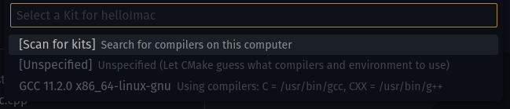
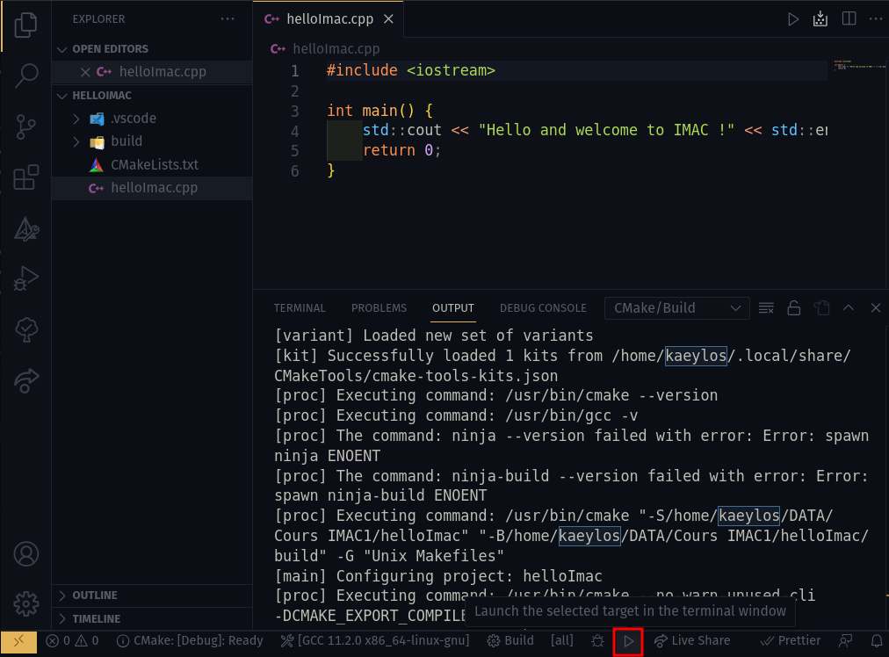
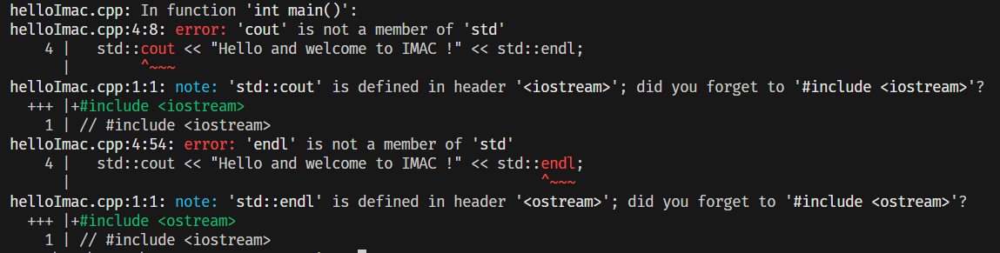
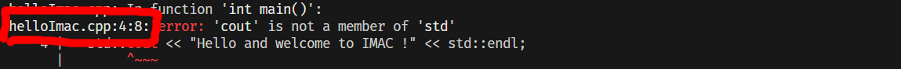

import Tabs from '@theme/Tabs';
import TabItem from '@theme/TabItem';

# Compiler votre premier programme

C'est maintenant le moment de compiler votre premier programme !

Vous pouvez créer un fichier d'extension *cpp* avec le code suivant :

```cpp title="helloImac.cpp"
#include <iostream>

int main()
{
    std::cout << "Hello and welcome to IMAC !" << std::endl;
    return 0;
}
```

Une fois le fichier créé, il suffit d'exécuter la commande suivante pour produire l'exécutable compilé :

```bash
g++ helloImac.cpp -o helloImac
```

Cela va produire un exécutable avec le nom choisi après le `-o`.

Une fois compilé il suffit de l'exécuter avec la commande suivante :

<Tabs groupId="operating-systems">
<TabItem value="Windows" label="Windows">

```bash
./helloImac.exe
```
</TabItem>

<TabItem value="Linux&MacOS" label="Linux et MacOS">

```bash
./helloImac
```

</TabItem>
</Tabs>

## Utiliser CMake et VSCode

C'est donc possible de le faire uniquement avec des lignes de commandes mais par simplicité nous allons dès maintenant utiliser **CMake** dont j'ai parlé précédemment qui s'intègre facilement avec **VSCode**.

Pour utiliser **CMake** il faut tout d'abord créer un fichier nommé **CMakeLists.txt**
Voici le premier qu'on va utiliser (quelques explications en commentaire **"#"** du fichier) :

```cmake title="CMakeLists.txt"
# Nous voulons un cmake "récent" pour utiliser les dernières fonctionnalités
cmake_minimum_required(VERSION 3.10)

# La version du C++ que l'on souhaite utiliser (dans notre cas C++17)
set(CMAKE_CXX_STANDARD 17)

# Le nom du projet
project(IMAC_project)

# On indique que l'on veut créer un exécutable "helloImac" compilé à partir du fichier helloImac.cpp
add_executable(helloImac helloImac.cpp)
```

Ce fichier **CMakeLists.txt** va être bien pratique car il est reconnu par divers **IDE** et en ce qui nous concerne on va l'utiliser avec **VSCode**.

Il suffit d'avoir au préalable installé l'extension dont je vous ai parlé <VSCodeExtension id="twxs.cmake"/> et d'ouvrir le dossier contenant le fichier **CMakeLists.txt** dans VSCode (il est recommandé de créer un dossier dédié au "projet" contenant les fichiers sources et le fichier **CMakeLists.txt**).
L'extension devrait normalement reconnaître automatiquement qu'il y a un fichier cmake et vous proposer d'initialiser celui-ci automatiquement.


Si c'est la première fois que vous l'ouvrez ce qui est sûrement le cas il devrait vous demander de choisir un **kit** de compilation et il faudra donc sélectionner **GCC** (ou **MSVC** si c'est ce que vous avez décidé d'installer).



:::tip
Si ce n'est pas le cas vous pouvez toujours utiliser le raccourci <kbd>Ctrl</kbd>+<kbd>Shift</kbd>+<kbd>P</kbd> puis taper et sélectionner "CMake: select a kit"
:::

Une fois tout initialisé, vous devriez voir des logs dans un terminal ressemblant à cela (dans mon cas sous **Linux** avec le compilateur **GCC** ici) :

```bash
[variant] Loaded new set of variants
[kit] Successfully loaded 1 kits from /home/user/.local/share/CMakeTools/cmake-tools-kits.json
[proc] Executing command: /usr/bin/cmake --version
[proc] Executing command: /usr/bin/gcc -v
[proc] The command: ninja --version failed with error: Error: spawn ninja ENOENT
[proc] The command: ninja-build --version failed with error: Error: spawn ninja-build ENOENT
[proc] Executing command: /usr/bin/cmake "-S/home/user/DATA/Cours IMAC1/helloImac" "-B/home/user/DATA/Cours IMAC1/helloImac/build" -G "Unix Makefiles"
[main] Configuring project: helloImac 
[proc] Executing command: /usr/bin/cmake --no-warn-unused-cli -DCMAKE_EXPORT_COMPILE_COMMANDS:BOOL=TRUE -DCMAKE_BUILD_TYPE:STRING=Debug -DCMAKE_C_COMPILER:FILEPATH=/usr/bin/gcc -DCMAKE_CXX_COMPILER:FILEPATH=/usr/bin/g++ "-S/home/user/DATA/Cours IMAC1/helloImac" "-B/home/user/DATA/Cours IMAC1/helloImac/build" -G "Unix Makefiles"
[cmake] Not searching for unused variables given on the command line.
[cmake] -- Configuring done
[cmake] -- Generating done
[cmake] -- Build files have been written to: /home/user/DATA/Cours IMAC1/helloImac/build
```

Vous pouvez maintenant cliquer sur le bouton **"play"**  dans la barre en bas pour exécuter le programme. 🥳



:::note
En cliquant sur ce bouton, l'**IDE** compile automatiquement si nécessaire puis exécute l'exécutable.
:::

:::note
Cmake devrait normalement créer un dossier **build**, c'est normal.
CMake est un outil de compilation mais ne compile pas directement, il permet de générer des fichiers permettant ensuite de compiler un projet.
Vous n'avez pas besoin d'aller voir ce qui s'y trouve, **CMake** gère automatiquement ce dossier **build** pour vous.
:::

:::caution
Pour qu'un projet **CMake** soit fonctionnel, il faut que le **dossier** ouvert dans votre **IDE** contienne un fichier **CMakeLists.txt** à la racine du dossier.

Sinon, l'extension **CMake** ne détectera pas le dossier ouvert comme un projet CMake et il ne va pas s'initialiser automatiquement. Les fonctionnalités de l'extension ne seront donc pas disponibles.
:::

## Quelques explications sur le programme

### #include ?

```cpp
#include <iostream>
```

Le but de notre programme est d’afficher un message. Des développeurs experts ont déjà créé un outil qui permet de le faire facilement. Il se trouve dans un fichier nommé **iostream**, acronyme de **"Input Output Stream"**, soit **"Flux d’Entrées Sorties"**. Ce fichier fait partie de la bibliothèque standard C++ **STD** (pour "C++ **ST**andar**D** library"), un ensemble de fonctionnalités déjà pré-codées et disponibles partout avec n'importe quel compilateur C++.

Pour utiliser les fonctionnalités offertes par ce fichier, notamment écrire un message avec `std::cout`, on doit l’importer dans notre programme. On dit qu’on l’inclut, d’où l’anglais "**include**". Nous utiliserons beaucoup cette fonctionnalité en C++.

Essayez donc de supprimer la ligne, puis compilez de nouveau votre programme et voyez ce qu'il se passe !



Le compilateur ne peut pas compiler notre programme, et il nous fournit donc une *erreur de compilation*. Il est très important d'apprendre à lire et comprendre ces erreurs car elles vous apportent beaucoup d'informations pour vous aider à corriger votre programme ! En l'occurrence elle nous indique que le symbole `std::cout` est introuvable, et nous donne même une piste pour corriger le problème : rajouter `#include <iostream>` !

Il nous indique même où l'erreur s'est produite :

cela signifie que c'est dans le fichier *helloImac.cpp*, à la ligne 4, et au 8ème caractère de cette ligne. Vous pouvez aussi <kbd>CTRL</kbd>+click dessus pour que VSCode vous emmène directement au bon endroit !

:::info

```#include``` s'appelle une **directive préprocesseur**. Le **préprocesseur** est un programme exécuté lors de la première phase de la compilation qui effectue des modifications textuelles sur le fichier source à partir de directives. Ces directives commencent par le caractère <kbd>#</kbd> et doivent se terminer par un saut de ligne.

Retenez simplement que ```#include``` nous permet d’importer des fichiers pour les inclure dans le programme que l'on est en train d'écrire, et je le détaillerai plus tard dans le semestre.

:::

### La fonction main

```cpp
int main()
{
    // ...
    return 0;
}
```

Lorsqu’on lance le programme, celui-ci doit savoir par où commencer. On parle de point d’entrée. Ce point d'entrée **doit** être une **fonction** nommée **main** et renvoyer une valeur avec le mot clé **return**.

Nous reviendrons sur les **fonctions** dans un autre chapitre mais retenez que c'est un ensemble d'instructions délimité par des accolades <kbd>\{</kbd> et <kbd>\}</kbd>, et auquel on donne un nom (```main``` dans ce cas).

:::note
La fonction **main** est un peu spéciale et sa valeur de retour (de type int) sert à indiquer si le programme s’est terminé sans erreur. Si tout se passe bien, il faut retourner **0**. N’importe quelle autre valeur indique une erreur.
:::

### Hello and welcome to IMAC !

L’instruction ci-dessous permet d’afficher le texte (qu'on appelle **"chaîne de caractères"**, ou **"string"**, en programmation) **"Hello and welcome to IMAC !"** sur la sortie standard du programme.

```cpp
std::cout << "Hello and welcome to IMAC !" << std::endl;
```

Premièrement "**std**" fait référence à la bibliothèque standard C++ dont je parlais précédemment.

`std::` permet d'indiquer que l'on veut utiliser une fonctionnalité particulière de cette bibliothèque, ici **cout** :

Il s’agit de l'objet (on parle de *stream* dans le jargon C++) permettant de renvoyer des caractères, généralement pour les afficher dans le terminal. Le **'c'** fait référence à **caractère** et **‘out’** indique **‘sortie’**.

Enfin, **std::endl** indique ici "end-line" soit la **'fin de ligne'**.

### Dernier point (virgule)

Chaque instruction doit être identifiable afin de que compilateur puisse faire son travail et produire un programme exécutable.

C'est le rôle du **point-virgule** <kbd>;</kbd> de délimiter chaque instruction et il est donc important de ne pas l'oublier.

On le retrouve par exemple dans notre programme à la fin du ```return 0;```.

:::caution
Ce n'est pas le cas pour les **directives préprocesseur** comme ```#include``` vu précédemment qui, elles, doivent avoir leur **propre ligne** et ne doivent pas se terminer par un point-virgule <kbd>;</kbd> mais un saut de ligne.
:::

Les sauts de lignes et espacements sont là pour améliorer la lisibilité mais pas pour le bon fonctionnement du compilateur en lui même et on pourrait très bien écrire :
```cpp
#include <iostream>
int main() { std::cout << "Hello and welcome to IMAC !" << std::endl; return 0; }
```

Je vous recommande tout de même d'utiliser des espacements et sauts de ligne pour mieux s'y retrouver et c'est ce que je vais faire tout au long de ce cours.

---

Et voilà ! Vous avez exécuté votre premier programme C++ à l'aide de VSCode ! 🎉