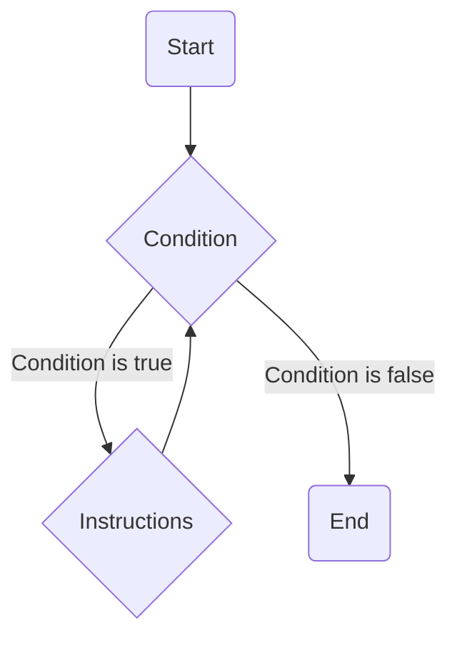

# Introduction

Nous avons maintenant la capacité d'exécuter des codes différents en fonction de **conditions**.
Cependant, notre programme reste essentiellement linéaire, car nous exécutons les instructions de haut en bas, l'un à la suite des autre.

Nous allons maintenant explorer de nouvelles structures de contrôles: les boucles.
Elles vont nous permettre de répéter plusieurs fois une série d'instructions, selon nos besoins.

## While - "Tant que ..."

La première est la boucle **while**, de l'anglais qui signifie « tant que ».
Elle exécute une série d’instructions tant que une condition est vraie. 
Une fois que la condition deviens fausse la boucle s’arrête et passe à la suite.



Je vous propose sans plus attendre un petit exemple:

```cpp
#include <iostream>
int main()
{
    int count { 10 };

    while (count > 0)
    {
        std::cout << count << std::endl;
        count--; // équivalent à "count -= 1;" ou encore "count = count -1;"
    }

    return 0;
}
```

Le code évalue la condition avant d'effectué quoi que ce soit. Dans notre cas si le **compte est supérieur à 0** alors on va affiche le nombre et le décrémenter.
Quand finalement count vaut 0, la condition devient fausse, on passe à la suite du code. (on ne va donc pas afficher la valeur 0)

:::caution
Attention aux boucles infinies !

Lorsque vous créez une boucle, assurez-vous qu'elle puisse s'arrêter à un moment ! Si la condition est toujours vraie, votre programme ne s'arrêtera jamais !
:::

## Do while

De manière très similaire il existe la boucle Do while, qui signifie " fait .. tant que..."

Ce type de boucle est moins utilisé. La seule chose qui change par rapport à une boucle while, c'est la position de la condition : au lieu d'être au début de la boucle, la condition est à la fin.

La boucle **while** peut très bien ne **jamais** être exécutée si la **condition est fausse dès le départ**.
Dans mon exemple précédent, si on avait initialisé le count à -1, la condition aurait été fausse dès le début, et on ne serait jamais rentré dans la boucle.

Pour la boucle do… while, on rentre au moins une fois à l'intérieur. En effet, le test se fait à la fin.

Il est donc parfois utile de faire des boucles de ce type, pour s'assurer que l'on rentre au moins une fois dans la boucle.

```cpp
#include <iostream>
int main()
{
    int sum {0};
    int number;
    
	do {
		std::cout << "Enter a number: ";

		std::cin >> number;

		sum += number;

	} while (number != 0);

	std::cout << "Sum is " << sum << std::endl;

	return 0;
}
```

:::caution
il y a une petit spécificité suplémentaire ici , il faut ajouter un "**;**" à la fin de la ligne contenant la condition while. 
:::


## For

Un des cas les plus fréquent avec les boucles est d'avoir un compteur et un nombre d'itération prédéfini.

On pourrait très bien le faire avec la boucle **while** comme on l'a vu précédement avec ce schéma:

```cpp
// initialisation (d'un compteur ou autres choses liée à la boucle)
while (/* condition */)
{
    // Instructions
    // Itération (mise à jour du compteur généralement)
}
```

Mais il existe une boucle dédiée à cela qui permet de séparer le reste de notre code de ce qui est lié à la boucle. Cela rends le code plus clair et plus compréhensible sutrout dans les cas ou l'on connais à l'avance le nombre d'itération.

C'est la boucle **for** ("pour" en anglais) et elle s'utilise selon le shéma suivant:

```cpp
// initialisation (d'un compteur ou autres choses liée à la boucle)
for (/*initialisation*/ ; /*condition*/ ; /*Itération*/)
{
    // Instructions
}
```

Voilà le même exemple qu'avec la boucle **while** mais ici avec la boucle **for** :

```cpp
#include <iostream>
int main()
{
    for (int count { 10 }; count > 0 ; count--)
    {
        std::cout << count << std::endl;
    }

    return 0;
}
```

l'avantage ici est le détail de ce que fait la boucle est plus clair est concentré au même endroit.

:::info

Un autre gros avantage est que la **portée de la variable** (scope) est **limitée** à la boucle et donc rends notre code plus sûr et propre.

```cpp
#include <iostream>
int main()
{
    for (int count { 10 }; count > 0 ; count--)
    {
        std::cout << count << std::endl;
    }
    
    std::cout << count << std::endl;

    return 0;
}
```

la variable count ici est uniquement nécessaires pour la boucle en question et n'a donc pas lieu d'être partagé ensuite avec le reste du code pour éviter des erreurs.
Si on essaye de le faire le compilateur nous donne l'erreur suivante:

```bash Compilation failed due to following error(s).
main.cpp: In function ‘int main()’:
main.cpp:17:18: error: ‘count’ was not declared in this scope
   17 |     std::cout << count << std::endl;
      |                  ^~~~~
```
:::

Vous pourriez vous demander "mais alors quand choisir une boucle **while** ou une boucle **for** ?"

C'est une question légitime et il n'y a pas de bonne réponse, vous êtes libre.
En général on utilise une boucle for dans le cas où l'on connait le nombre d'itération à l'avance (un compteur, un nombre de niveaux ou de joueurs dans un jeu, etc...).
La boucle while, quant à elle, est généralement utilisé pour effectuer des actions sans savoir à l'avance le nombre d'itérations que l'on va effectuer (par exemple la gestion de l'entrée utilisateur ou dans un jeu faire bouger un ennemie **tant qu**'il n'a pas atteint sa cible)

:::tip
Plus simplement, essayer de dire ce que vous voulez faire et si votre phrase contient "pour" ou "pour chaque ... faire ..." il est préférable d'utiliser une boucle **for**. Et si vous vous dîtes "Tant que ... faire ..." alors vous devriez utiliser une boucle **while**.
:::

## Contrôler l'execution

Les boucles sont très utiles, mais parfois on aimerait pouvoir controler plus finement les instructions à l’intérieur des accolades et pouvoir s'arrêter plus tôt ou ne pas executer les instructions pour un cas particulier.

Il existe en C++ deux mots: **break** et **continue**

### Break
**Break** (de anglais "casser"/"interrompre") permet d'interompre une boucle et mettre fin à l’exécution de celle-ci peut importe où on en est.

Voyons un exemple plus "complexe" ensemble:
```cpp
for (int i { 0 }; i < 5; ++i)
    {
        std::cout << "i : " << i << std::endl;
        
        for (int j { 0 }; j < i; ++j)
        {
            if (j == 2)
            {
                std::cout << "break j == 2" << std::endl;
                break;
            }
    
            std::cout << "j : " << j << std::endl;
        }
        std::cout << std::endl;
        
    }
```

qui nous donne le résultat suivant:

```bash
i: 0

i: 1
j: 0

i: 2
j: 0
j: 1

i: 3
j: 0
j: 1
break j == 2

i: 4
j: 0
j: 1
break j == 2
```

Ici il y a plusieurs choses qui se passent:
- il y a déjà deux boucles imbriquées, et oui rien ne nous empèche de faire ça en C++
- la deuxième boucle (sur la variable **j**) dépends de la variable **i** de la première (c'est parfois utile de faire et je vous montre donc un petit exemple)
- ici le mot clé break permet d'interompre la boucle de la variable j si la valeur de J est égale à 2.

Une petit analyse des itérations s'impose:

- la première fois i est égale à 0 et donc la condition j < i est directement fausse vu que j aussi est egale à 0.
ensuite
- ensuite i est égale à 1 et donc on passe une fois seulement dans la boucle du j car à la second iterations j deviens égale à i et invalide la condition j < i.
- la troisième fois c'est le break qui entre en jeu et permet d'intérompre la boucle quand j est égal à 2 (à noter que la condition de la boucle aurrait aussi invalidé la condition j < i>)
- enfin ici le break prendre tout son sens car s'il n'était pas là, on aurait encore continuer un tour car j étant égal à 3 n'aurait pas invalidé la condition (j < i) car i est égal à 4 et que 3 < 4.

:::caution
Comme nous venons de le voir, dans le cas de boucles imbriquées cela arrête seulement la boucle du niveau au dessus et pas toutes les boucles.
:::

### Continue

L’autre mot-clef, **continue**, permet de sauter l’itération courante.

Toutes les instructions du bloc sont ignorées et la boucle continue au tour suivant.

un petit exemple:

```cpp
for (int i { 0 }; i < 5; ++i)
{
    if( i == 3)
    {
        continue;
    }
    std::cout << "i : " << i << std::endl;
}
```

```bash Ce qui nous donne:
i : 0
i : 1
i : 2
i : 4
```

:::danger

Comme cela interrompt la totalité des instructions suivantes de la boucle cela peut être dangeureux dans le cas d'une boucle **while**:

```cpp
#include <iostream>
int main()
{
    int count { 10 };

    while (count > 0)
    {
        std::cout << count << std::endl;

        if (count == 5)
        {
            continue;
        }
        count--;
    }

    return 0;
}
```

Ici, l'instruction de ```count--;``` ne sera donc jamais appelée une fois que count devient égale à 5.
Count restera donc égal à 5 indéfiniment: C'est une **boucle infinie**.

:::

## Switch

Mainteant que nous avons toutes les cartes en main revenons brievement au **switch** dont je vous parlais au chapitre précédan sur les conditions.

Très souvant on veux tester la valeurs d'une variable et effectuer telle ou telle action en fonction de valeur valeur. On pourrait très bien écrire cela avec des **if else**:

```cpp
#include <iostream>
int main() {
    int value { 42 };
    if ( value == 12 ) {
        // ...
    } else if ( value == 33 ) {
        // ...
    } else  if ( value == 52) {
        //...
    } else {
        //...  
    }
    return 0;
}
```

C'est avec le mot clé "**switch**" que l'on va pouvoir faire ça de cette façon plus lisible:

```cpp
#include <iostream>
int main() {
    int value { 42 };
    switch (value) {
        case 12:
            // ...
            break; // permet de quitter le bloc switch
        case 33:
            // ...
            break;
        case 52:
            // ...
            break;
        default:
            // ...
            break;
    }

    return 0;
}
```

Lorsque l'expression testée est égale à une des valeurs listé avec les mot clé **case**, la **totalité** des d'instructions qui suive sont exécutées. 
Le mot clé **break** indique la sortie de la structure de contrôle.
Le mot clé **default** indique quelles instructions exécuter si l'expression n'est jamais égale à une des valeurs.

:::danger
De manière général, n'oubliez pas d'insérer des instructions **break** entre chaque test, ce genre d'oubli est difficile à détecter car aucune erreur n'est signalée...
En effet la **totalité** des instructions suivante sont exécutées et donc on pourrait se retrouver à exécuter des instructions de manière involontaire.

```cpp
#include <iostream>
int main() {
    int value { 33 };
    switch (value) {
        case 12:
            std::cout << "value est égale à 12" << std::endl;
        case 33:
            std::cout << "value est égale à 33" << std::endl;
        default:
            std::cout << "value est différent de 12 ou 33" << std::endl;
    }

    return 0;
}
```

```bash qui nous donne:
value est égale à 33
value est différent de 12 ou 33
```

Cela peut être parfois "voulu" mais ici on se rends bien compte qu'il y a un problème et il ne faut donc pas oublié le mot clé **break**.
:::