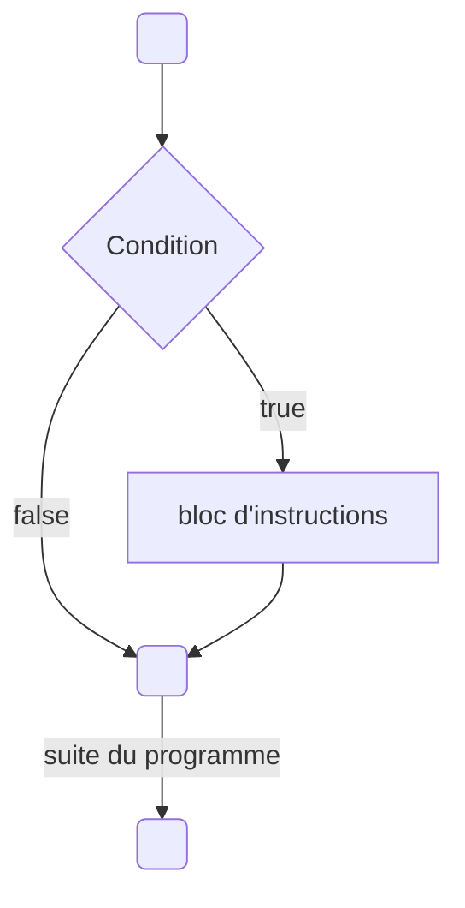
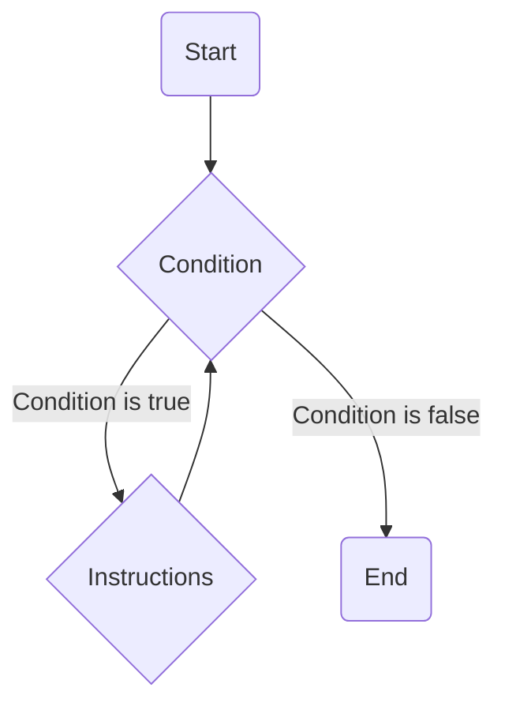

On sait maintenant comment stocker des valeurs dans des variables et comment les manipuler avec des opérations mathématiques. Mais il est temps de voir comment on peut contrôler l'exécution de notre programme en fonction de conditions et de répéter des instructions plusieurs fois.

Le C++ va nous permettre d'exprimer des **conditions** sur les valeurs de nos variables afin d'exécuter des instructions différentes en fonction du résultat des conditions.

## Conditions

### Les valeurs booléennes

J'ai omis un type lors du précédent chapitre, il s'agit du **type booléen**, il s'utilise avec le mot clé **bool**.

Ce type peut prendre deux valeurs: soit **true**, signifiant vrai, soit **false** qui veut dire faux. C'est donc idéal pour stocker le résultat d'une condition.

```cpp title="Voici un petit exemple"
int main()
{
    bool const condition { true };
    return 0;
}
```

Cela va devenir intéressant grâce à ce que l'on appelle les **opérateurs de comparaison**.

| Opérateur	| Signification	|
|-|-|
| == |	**Égalité**, compare si deux variables sont **égales** |
| != |	**Inégalité**, compare si deux variables sont **différentes** |
| \<  |	**Strictement inférieur**, compare si la variable de gauche est **strictement inférieure** à celle de droite |
| \<= |	**Inférieur ou égal**, compare si la variable de gauche est **inférieure ou égale** à celle de droite |
| >  |	**Strictement supérieur**, compare si la variable de gauche est **strictement supérieure** à celle de droite |
| >= |	**Supérieur ou égal**, compare si la variable de gauche est **supérieure ou égale** à celle de droite |

Ces opérateurs vont nous permettre de créer des conditions (des valeurs booléennes) à partir de nos autres variables.

```cpp
#include <iostream>
int main()
{
    float const a { 10.0f };
    float const b { 20.0f };

    std::cout << a << " == " << b << " donne " << (a == b) << std::endl;
    std::cout << a << " != " << b << " donne " << (a != b) << std::endl;
    std::cout << a << " < " << b << " donne " << (a < b) << std::endl;
    std::cout << a << " <= " << b << " donne " << (a <= b) << std::endl;

    // On peut aussi stocker le résultat de la condition dans une variable booléenne
    float const price { 24.5f };
    bool const is_too_expensive { price >= 100.f };

    return 0;
}
```

:::note
Par défaut, ```std::cout``` affiche 1 pour une condition vraie (true) et 0 pour une condition fausse (false).

Il est possible de changer ce comportement en ajoutant un "modificateur" sur le stream ```std::cout```:

```cpp
#include <iostream>
int main()
{
    float const a { 10.0f };
    float const b { 20.0f };

    std::cout << std::boolalpha;
    std::cout << a << " == " << b << " donne " << (a == b) << std::endl;

    return 0;
}
```
:::

### Opérateurs logiques

Maintenant que nous disposons d'un moyen d'obtenir une valeur booléenne (via les opérateurs de comparaison) nous allons pouvoir manipuler ces valeurs avec ce que l'on nomme des **opérateurs logiques**.

Ces opérateurs vont permettre de combiner et modifier des valeurs booléennes afin d'en obtenir d'autres et faire ce que l'on appelle plus généralement de l’**algèbre booléenne**.
Mais ne vous inquiétez pas, derrière ce nom très mathématique se cache des choses très simples.

#### NOT: La négation

L'opérateur ```!``` (placé devant une valeur booléenne) permet d'exprimer la négation d'une condition.

:::note
C'est ici un opérateur dit **unaire** (qui s'applique sur une seule valeur) et donne en retour la condition inverse.
:::

Voici ce qu’on appelle la **table de vérité** de l’opérateur **NOT**, qui formalise les entrées et les sorties de cet opérateur.

| A     | Résultat |
|-------|----------|
| true  | false    |
| false | true     |

```cpp
float price { 114.2f };
bool isExpensive { price >= 100.f };

bool isCheap { !isExpensive };
```

#### AND
L'opérateur ```&&``` (placé entre deux valeurs booléennes) permet d'exprimer la validité de deux conditions **en même temps**.
On peut l'interpréter en français par : "ma condition1 est vraie **ET** ma condition2 est aussi vraie".

| A     | B     | Résultat |
|-------|-------|----------|
| true  | true  | true     |
| true  | false | false    |
| false | true  | false    |
| false | false | false    |

#### OR

L'opérateur ```||``` (placé entre deux valeurs booléennes) permet d'exprimer si **au moins une des deux** conditions est **vraie**.
On peut l'interpréter en français par : "ma condition1 est vraie **OU** ma condition2 est vraie".


| A     | B     | Résultat |
|-------|-------|----------|
| true  | true  | true     |
| true  | false | true     |
| false | true  | true     |
| false | false | false    |

---

:::note
Il est également possible d'utiliser les mots-clés ```and```, ```or``` et ```not``` pour remplacer respectivement les opérateurs ```&&```, ```||``` et ```!```.

C'est possible mais très peu répandu en C++ c'est pourquoi je ne l'utiliserai pas personnellement mais sachez que ça existe également.

Avec de vielles versions de Visual Studio il est possible que cette syntaxe ne fonctionne pas et dans ce cas il faut inclure le fichier ```<ciso646>```.
:::

:::danger
Pour l'opérateur **AND** (```&&```) on note qu'il y a bien deux fois le symbole <kbd>&</kbd>. C'est très important car il existe un autre opérateur (avec un seul **&**) qui fait tout autre chose.
Je ne détaillerai pas dans ce chapitre son utilité mais il est important de le souligner car c'est une erreur qui arrive fréquemment.

De même pour l'opérateur **OR** (```||```) différent de <kbd>|</kbd>.
:::

## Des structures de contrôle

C'est bien beau toutes ces valeurs booléennes mais comment on peut s'en servir pour exécuter une partie d'un code ou un autre en fonction d'une condition ?

### If
Notre première structure de contrôle va s'utiliser avec le mot clé **if**.
De l'anglais, ce mot clé signifiant **"si"**, exécute des instructions si et seulement si la condition donnée est vraie.

Un petit schéma d'explications:



Voilà comment l'utiliser. Toutes les instructions entre accolades seront exécutées si la condition est vraie.

```cpp
if( /* condtion */ )
{
    // ...
}
```

```cpp title="Un petit exemple"
#include <iostream>
int main()
{
    float price { 114.2f };

    if ( price >= 100.f )
    {
        // appliquer une réduction si l'on dépasse un certain prix
        price *= 0.9f;
    }

    std::cout << "Le prix final est de " << price << "€" << std::endl;

    return 0;
}
```

:::caution
Il est possible de créer des variables à l'intérieur même des accolades de la structure de contrôle mais celles-ci sont restreintes à cette **portée**.
C'est ce qu'on appelle la portée des variables (**scope** en anglais).

Plus généralement, cette règle du C++ s'applique à n'importe quel bloc entre accolades.
**Une variable n’est utilisable que dans la portée, ou le bloc d’accolades où elle a été déclarée.**

Nous en reparlerons plus en détail dans d'autres chapitres.
:::

:::caution
Il n'est pas très utile de tester par une égalité le résultat d'une condition :
```cpp
float const price { 114.2f };
bool const isExpensive { price >= 100.f };

if ( isExpensive == true )
{
    // ...
}
```
```isExpensive``` ici étant déjà une valeur booléenne ajouter une égalité supplémentaire avec la valeur ```true``` ne va rien faire d'autre que de créer une nouvelle valeur booléenne qui a la même valeur.

Il est donc plus clair et concis d'écrire directement:

```cpp
bool const isExpensive { price >= 100.f };

if ( isExpensive )
{
    // ...
}
```
:::

### Else

C'est très bien de pouvoir effectuer quelque chose si une condition est vérifée mais comment faire si l'on veut effectuer une action A si la condition est vérifée et une autre action B si ce n'est pas le cas ?

On pourrait très bien enchaîner deux ```if``` avec la condition opposée:

```cpp
#include <iostream>
int main()
{
    float temperature { 24.0f };

    if ( temperature >= 35.f )
    {
        std::cout << "il fait chaud" << std::endl;
    }

    if ( temperature < 35.f )
    {
        std::cout << "il fait froid" << std::endl;
    }

    return 0;
}
```

Mais c'est là que le mot-clé ```else``` (de l'anglais "sinon") nous permet d'exécuter des instructions si la condition du ```if``` est fausse de manière plus compréhensible:

```cpp
#include <iostream>
int main()
{
    float temperature { 24.0f };

    if ( temperature >= 35.f )
    {
        std::cout << "il fait chaud" << std::endl;
    }
    else
    {
        std::cout << "il fait froid" << std::endl;
    }

    return 0;
}
```

Ici le **else** n'a pas de parenthèse et indique donc "tout le reste" (ce qui ne vérifie pas la condition).

:::note
L'opérateur logique de négation <kbd>!</kbd> est parfois très utile dans le cas où l'on avait stocké une valeur mais l'on souhaite faire une suite d'instructions uniquement dans le bloc ```else``` du ```if```.

Au lieu de faire :
```cpp
#include <iostream>
int main()
{
    bool condition { false };

    if ( condition )
    {
        // ... ne rien faire
    }
    else
    {
        // effectuer nos instructions
    }

    return 0;
}
```

Il est préférable de faire:

```cpp
#include <iostream>
int main()
{
    bool condition { false };

    if ( !condition )
    {
        // effectuer nos instructions
    }

    return 0;
}
```
:::

Mais comment tester une succession de conditions différentes avant de faire "tout le reste" ?

### Else if

On pourrait très bien chaîner plusieurs ```if``` et ```else``` imbriqués de cette manière:

```cpp
#include <iostream>
int main()
{
    float temperature { 24.0f };

    if ( /* condition1 */ )
    {
        // ...
    }
    else
    {
        if ( /* condition2 */ )
        {
            // ...
        }
        else
        {
            if ( /* condition3 */ )
            {
                //...
            }
            else 
            {
               //...  
            }
        }
    }
    return 0;
}
```

Mais vous êtes sûrement d'accord pour dire que ça commence à être difficile à suivre et écrire à cause des imbrications.
Le C++ est bien fait et nous permet de d'utiliser la combinaison ```else if``` pour ce cas de figure.

```else if``` s’utilise entre un ```if``` et un ```else``` et signifie "ou alors si cette condition est vraie".

```cpp
#include <iostream>
int main()
{
    if ( /* condition1 */ )
    {
        // ...
    }
    else if ( /* condition2 */ )
    {
        // ...
    }
    else  if ( /* condition3 */ )
    {
        //...
    }
    else
    {
        //...  
    }

    return 0;
}
```

:::note
Enfin, il existe une dernière syntaxe (le ```switch``` pour les curieux) qui permet de faire quelque chose de similaire au ```else if``` lorsque nos conditions sont des égalités sur une même variable. mais il nous manque quelques notions avant de pouvoir l'aborder correctement. Nous y reviendrons plus tard dans ce chapitre.
:::

### Faux-ami

:::danger
Attention le test d'égalité ```==``` est différent de l'opérateur d'affectation ```=```.
:::

```cpp
int number { 20 };
if ( number = 10 )
{
    // ...
}
```
En **C++**, l'assignation retourne la valeur de la variable assignée. Ici, la condition sera vraie car ```number``` vaut 10 après l'assignation et 10 est considéré comme vrai.

Les valeurs numériques non nulles sont considérées comme vraies et la valeur 0 est considérée comme fausse.

### Combinaison d'expressions et logique booléenne

Avec tous les opérateurs logiques vu précédemment il est même possible de tester plusieurs conditions dans un même ```if```.

```cpp
#include <iostream>
int main()
{

    float temperature { 24.0f };
    bool const isRaining { false };
    bool const wantToGoOut { true };
    bool const ownsAnUmbrella { false };

    if ( wantToGoOut && (!isRaining || (isRaining && ownsAnUmbrella) ) )
    {
        // ...
    }
    else
    {
        //...  
    }

    return 0;
}
```

:::danger
Les opérateurs logiques sont comme les opérateurs mathématiques que nous avons vus dans les chapitres précédents: ils ont une priorité.

1. Le plus prioritaire est la négation <kbd>!</kbd>
2. Ensuite c'est le **ET** <kbd>&&</kbd>
3. Enfin, le **OU** <kbd>||</kbd> est le moins prioritaire

Par exemple avec le code ```a && b || c && d```, dans l’ordre, on évalue ```a && b```, ```c && d``` et enfin ```(a && b) || (c && d)```.

Pour des raisons de lisibilité je vous recommande très fortement d'ajouter des parenthèses (comme dans mon exemple ci-dessus) pour expliciter quelles opérations vous voulez prioriser dans ce genre de cas plus "complexe".
:::

#### Pour aller plus loin: Algèbre de Boole

Enfin, pour aller encore plus loin il est possible de manipuler les opérateurs ```&&```, ```||``` et ```!``` et trouver des expressions donnant le même résultat.
Cela permet parfois de simplifier le code ou alors d'exprimer la condition sous une forme plus lisible ou compréhensible.

Dans mon exemple précédent la condition ```(!isRaining || (isRaining && ownsAnUmbrella))``` est équivalente à écrire ```(!isRaining || ownsAnUmbrella)```.

En effet, si il ne **pleut pas**(`!isRaining`) , peu importe si j'ai un parapluie ou non, je peux sortir, Si cependant la première condition est fausse (il pleut) alors inutile de vérifier de nouveau si il pleut (`!isRaining || (isRaining &&...`) c'est implicite par la première condition et donc il suffit de vérifier si j'ai un parapluie.

Il existe aussi le **théorème de De Morgan** qui permet d'exprimer la négation d'un **ET** avec un **OU** et inversement.

Il est possible d'exprimer mon exemple précédent sous cette forme:

```(!isRaining || ownsAnUmbrella)``` équivalent à ```!(isRaining && !ownsAnUmbrella)```

On peut s'en convaincre en essayant de traduire ces conditions en phrases:

```(!isRaining || ownsAnUmbrella)```: c'est le cas où il ne pleut pas ou alors j'ai un parapluie.
```!(isRaining && !ownsAnUmbrella)``` ce n'est **pas** le cas où il pleut et je n'ai pas de parapluie.

Vous trouverez des exemples de propriétés et simplifications possibles sur la page Wikipédia suivante:
[Algèbre de Boole](https://fr.wikipedia.org/wiki/Alg%C3%A8bre_de_Boole_(logique))

## Boucles

Nous avons maintenant la capacité d'exécuter des codes différents en fonction de **conditions**.
Cependant, notre programme reste essentiellement linéaire, car nous exécutons les instructions de haut en bas, l'un à la suite des autres.

Nous allons maintenant explorer de nouvelles structures de contrôle: les **boucles**.
Elles vont nous permettre de répéter plusieurs fois une série d'instructions, selon nos besoins.

### While - "Tant que ..."

La première est la boucle **while**, de l'anglais qui signifie "tant que".
Elle exécute une série d’instructions tant qu'une condition est vraie. 
Une fois que la condition devient fausse la boucle s’arrête et passe à la suite.



```cpp title="Un petit exemple"
#include <iostream>
int main()
{
    int count { 0 }; // initialisation (d'un compteur ou autre chose lié à la boucle)
    while ( count < 10 /* condition */)
    {
        std::cout << count << std::endl; // Instructions
        count++; // Itération (mise à jour du compteur généralement)
    }

    return 0;
}
```

Le code évalue la condition avant d'effectuer quoi que ce soit. Dans notre cas si le **compte est inférieur à 10** alors on va afficher le nombre et l'incrémenter.
Quand finalement count vaut 10, la condition devient fausse, on passe à la suite du code. (**on ne va donc pas afficher la valeur 10**)

:::caution
Attention aux **boucles infinies** !

Lorsque vous créez une boucle, assurez-vous qu'elle puisse s'arrêter à un moment ! Si la condition est toujours vraie, votre programme ne s'arrêtera jamais !
:::

### Do while

De manière très similaire il existe la boucle ```Do... while```, qui signifie "fait .. tant que..."

Ce type de boucle est moins utilisé. La seule chose qui change par rapport à une boucle while, c'est la position de la condition : au lieu d'être au début de la boucle, la condition est à la fin.

:::note
La boucle ```while``` peut très bien ne **jamais** être exécutée si la **condition est fausse dès le départ**.
Dans mon exemple précédent, si on avait initialisé le count à ```20```, la condition aurait été fausse dès le début, et on ne serait jamais rentré dans la boucle.
:::

Pour la boucle ```Do... while```, on rentre **au moins une fois** à l'intérieur. Le test se fait à la fin.

Il est donc parfois utile de faire des boucles de ce type, pour s'assurer que l'on rentre au moins une fois dans la boucle.

```cpp
#include <iostream>
int main()
{
    int sum {0};
    // On déclare la variable en dehors de la boucle pour pouvoir l'utiliser après
    // Il n'est pas nécessaire de l'initialiser ici car on va écrire une valeur avant de l'utiliser mais c'est une bonne pratique pour éviter les valeurs indéfinies
    int number {};
    
	do {
		std::cout << "Entre un nombre: ";

		std::cin >> number;

		sum += number;

	} while (number != 0);

	std::cout << "La somme vaut " << sum << std::endl;

	return 0;
}
```

:::caution
Il y a une petite spécificité supplémentaire ici, il faut ajouter un "**;**" à la fin de la ligne contenant la condition while.
:::

### For

Un des cas les plus fréquents avec les boucles est d'avoir un compteur et un nombre d'itérations prédéfini.

On pourrait très bien le faire avec la boucle ```while```:

```cpp
int count { 0 }; // initialisation (d'un compteur ou autre chose lié à la boucle)
while ( count < 10 /* condition */)
{
    // Instructions
    count++; // Itération (mise à jour du compteur généralement)
}
```

Mais il existe une boucle dédiée à cela qui permet de séparer le reste de notre code de ce qui est lié à la boucle. Cela rend le code plus clair et plus compréhensible surtout dans le cas ou l'on connait à l'avance le nombre d'itérations.

C'est la boucle ```for``` ("**pour**" en anglais) et elle s'utilise selon le schéma suivant:

```cpp
for (int count {0} /*initialisation*/ ; count < 10 /*condition*/ ; count++/*Itération*/)
{
    // Instructions
}
```

Voilà le même exemple qu'avec la boucle ```while``` mais ici avec la boucle ```for``` :

```cpp
#include <iostream>
int main()
{
    for (int count { 0 }; count < 10 ; count++)
    {
        std::cout << count << std::endl;
    }

    return 0;
}
```

L'avantage ici est que le détail de ce que fait la boucle est concentré sur une même ligne.

:::info
Un autre gros avantage est que la **portée de la variable** (**scope**) est **limitée** à la boucle et donc rend notre code plus sûr et propre.

```cpp
#include <iostream>
int main()
{
    for (int count { 10 }; count > 0 ; count--)
    {
        std::cout << count << std::endl;
    }
    
    std::cout << count << std::endl;

    return 0;
}
```

La variable ```count``` ici est uniquement nécessaire pour la boucle en question et n'a donc pas lieu d'être partagée ensuite avec le reste du code pour éviter des erreurs.
Si on essaye de le faire le compilateur nous donne l'erreur suivante:

```bash title="Compilation failed due to following error(s)"
main.cpp: In function ‘int main()’:
main.cpp:17:18: error: ‘count’ was not declared in this scope
   17 |     std::cout << count << std::endl;
      |                  ^~~~~
```
:::

Mais alors quand choisir une boucle ```while``` ou une boucle ```for``` ?

C'est une question légitime et il n'y a pas de bonne réponse, vous êtes libre.
En général on utilise une boucle ```for``` dans le cas où l'on **connaît** le nombre d'itérations à l'avance (un compteur, un nombre de niveaux ou de joueurs dans un jeu, etc...).
La boucle ```while```, quant à elle, est généralement utilisée pour effectuer des actions sans savoir à l'avance le nombre d'itérations que l'on va effectuer (par exemple la gestion de l'entrée utilisateur ou dans un jeu faire bouger un ennemi **tant qu**'il n'a pas atteint sa cible)

:::tip
Plus simplement, essayez de dire ce que vous voulez faire et si votre phrase contient "**pour**" ou "**pour chaque ... faire ...**" il est préférable d'utiliser une boucle ```for```. Et si vous vous dîtes "**Tant que ... faire ...**" alors vous devriez utiliser une boucle ```while```.
:::

### Contrôler l'exécution

Les boucles sont très utiles, mais parfois on aimerait pouvoir contrôler plus finement les instructions à l’intérieur des accolades et pouvoir s'arrêter plus tôt ou ne pas exécuter les instructions pour un cas particulier.

Il existe en **C++** deux mots-clés: **break** et **continue**

#### Break
**Break** (de anglais "casser"/"interrompre") permet d'interrompre une boucle et mettre fin à l’exécution de celle-ci peu importe où on en est.

Voyons un exemple plus "complexe" ensemble:
```cpp
for (int i { 0 }; i < 5; ++i)
    {
        std::cout << "i : " << i << std::endl;
        
        for (int j { 0 }; j < i; ++j)
        {
            if (j == 2)
            {
                std::cout << "break j == 2" << std::endl;
                break;
            }
    
            std::cout << "j : " << j << std::endl;
        }
        std::cout << std::endl;
        
    }
```

qui nous donne le résultat suivant:

```bash
i: 0

i: 1
j: 0

i: 2
j: 0
j: 1

i: 3
j: 0
j: 1
break j == 2

i: 4
j: 0
j: 1
break j == 2
```

Ici il y a plusieurs choses qui se passent:
- il y a déjà deux boucles imbriquées, et oui rien ne nous empêche de faire cela en C++
- la deuxième boucle (sur la variable **j**) dépend de la variable **i** de la première (c'est parfois utile de le faire et je vous montre donc un petit exemple)
- ici le mot clé ```break``` permet d'interrompre la boucle de la variable j si la valeur de j est égale à 2.

Une petite analyse des itérations s'impose:

- la première fois i est égal à 0 et donc la condition ```j < i``` est directement fausse vu que j aussi est égal à 0.
ensuite
- ensuite i est égal à 1 et donc on passe une fois seulement dans la boucle du j car à la seconde itération j devient égal à i et invalide la condition ```j < i```.
- la troisième fois c'est le ```break``` qui entre en jeu et permet d'interrompre la boucle quand j est égal à 2 (à noter que la condition de la boucle aurait aussi invalidé la condition ```j < i```)
- enfin ici le ```break``` prend tout son sens car s'il n'était pas là, on aurait encore continué un tour car j étant égal à 3, la condition (```j < i```) serait valide car i est égal à 4 et que ```3 < 4```.

:::caution
Comme nous venons de le voir, dans le cas de boucles imbriquées cela arrête seulement la boucle du niveau au dessus et pas toutes les boucles.
:::

#### Continue

L’autre mot-clé, ```continue```, permet de sauter l’itération courante.

Toutes les instructions restantes du bloc sont ignorées et la boucle continue au tour suivant.

```cpp
for (int i { 0 }; i < 5; ++i)
{
    if( i == 3)
    {
        continue;
    }
    std::cout << "i : " << i << std::endl;
}
```
Ce qui nous donne:

```bash
i : 0
i : 1
i : 2
i : 4
```

:::danger
Comme cela interrompt la totalité des instructions suivantes de la boucle cela peut être dangereux dans le cas d'une boucle **while**:

```cpp
#include <iostream>
int main()
{
    int count { 10 };

    while (count > 0)
    {
        std::cout << count << std::endl;

        if (count == 5)
        {
            continue;
        }
        count--;
    }

    return 0;
}
```

Ici, l'instruction de ```count--;``` ne sera donc jamais appelée une fois que ```count``` devient égal à 5.
```count``` restera donc égal à 5 indéfiniment: C'est une **boucle infinie**.
:::

## Nouvelle structure de contrôle: switch

Maintenant que nous avons toutes les cartes en main revenons brièvement au **switch** dont je vous parlais précédemment.

Très souvent on veut seulement tester la valeur d'une variable et effectuer telle ou telle action en fonction. On pourrait très bien écrire cela avec des ```else if```:

```cpp
#include <iostream>
int main()
{
    int value { 42 };
    if ( value == 12 )
    {
        // ...
    }
    else if ( value == 33 )
    {
        // ...
    }
    else  if ( value == 52)
    {
        //...
    }
    else
    {
        //...  
    }
    return 0;
}
```

C'est avec le mot clé ```switch``` que l'on va pouvoir faire cela de façon plus lisible:

```cpp
#include <iostream>
int main()
{
    int value { 42 };
    switch (value)
    {
        case 12:
            // ...
            break; // permet de quitter le bloc switch
        case 33:
            // ...
            break;
        case 52:
            // ...
            break;
        default:
            // ...
            break;
    }

    return 0;
}
```

Lorsque l'expression testée est égale à une des valeurs listées avec les mots-clés ```case``` la **totalité** des instructions qui suivent sont exécutées. 
Le mot clé ```break``` indique la sortie de la structure de contrôle.
Le mot clé ```default``` indique quelles instructions exécuter si l'expression n'est jamais égale à une des valeurs.

:::danger
De manière générale, n'oubliez pas d'insérer des instructions ```break``` entre chaque test, ce genre d'oubli est difficile à détecter car aucune erreur n'est signalée...
En effet la **totalité** des instructions suivant le ```case``` sont exécutées et donc on pourrait se retrouver à exécuter des instructions de manière involontaire.

```cpp
#include <iostream>
int main()
{
    int value { 33 };
    switch (value)
    {
        case 12:
            std::cout << "value est égale à 12" << std::endl;
        case 33:
            std::cout << "value est égale à 33" << std::endl;
        default:
            std::cout << "value est différent de 12 ou 33" << std::endl;
    }

    return 0;
}
```
qui nous donne:

```bash
value est égale à 33
value est différent de 12 ou 33
```

Cela peut être parfois voulu mais ici on se rend bien compte qu'il y a un problème et il ne faut donc pas oublier le mot clé ```break```.

Voici un exemple où cela peut être utile:

```cpp
#include <iostream>
int main()
{
    char letter { 'e' };
    switch(letter)
    {
        case 'a':
        case 'e':
        case 'i':
        case 'o':
        case 'u':
        case 'y':
            std::cout << "You entered a vowel." << std::endl;
            break;
        default:
            std::cout << "You entered a consonant." << std::endl;
            break;
    }

    return 0;
}
```

Certains warnings de compilateur permette d'indiquer ce genre de cas mais c'est mieux d'y faire attention.
:::

:::warning Switch et chaînes de caractères

Il est important de noter que le mot clé `switch` ne peut pas être utilisé avec des chaînes de caractères. Il ne peut être utilisé qu'avec des types entiers (`int`, `char`, `short`, `long`, etc...) ou encore les [**énumérations**](/Lessons/S1/Variables/#enum-un-type-supplémentaire).

il est possible de faire cela avec des `if` et `else if` mais généralement lors de l'utilisation de switch on connaît à l'avance les valeurs possibles et donc on utilisera de préférence des [**énumérations**](/Lessons/S1/Variables/#enum-un-type-supplémentaire) ou des constantes.
:::

## En résumé

- Une valeur booléenne est du type **bool** et peut prendre comme valeur ```true``` ou ```false```.
- On obtient une valeur booléenne avec une condition sur nos variables (avec les opérateurs de comparaison <kbd>==</kbd>, <kbd>!=</kbd>, <kbd>\<</kbd>, <kbd>\<=</kbd>, <kbd>></kbd> ou <kbd>>=</kbd>)

- Les opérateurs <kbd>&&</kbd>, <kbd>||</kbd> et <kbd>!</kbd> permettent de modifier et combiner les valeurs booléennes.
- On utilise les structures de contrôle ```if```, ```else```, ```else if``` pour exécuter des instructions différentes en fonction des conditions.

---

- Il existe trois types de boucle:
  - la boucle ```while``` qui permet d'exécuter des instructions tant qu'une condition est vérifiée.
  - la boucle ```Do while``` qui permet de faire la même chose que la boucle ```while``` mais en faisant le test seulement à la fin et permettant d'exécuter les instructions **au moins une fois**.
  - la boucle ```for``` plus utile en pratique quand l'on connait à l'avance le nombre d'itérations à effectuer. Elle permet aussi de mieux "scoper" les variables et **limiter leur portée**.

- Il existe deux mots-clés ```break``` et ```continue``` qui permettent de contrôler plus finement les boucles.
- La structure de contrôle ```switch``` est une alternative au ```else if``` compatible seulement avec des types entiers et les [**énumérations**](/Lessons/S1/Variables/#enum-un-type-supplémentaire).