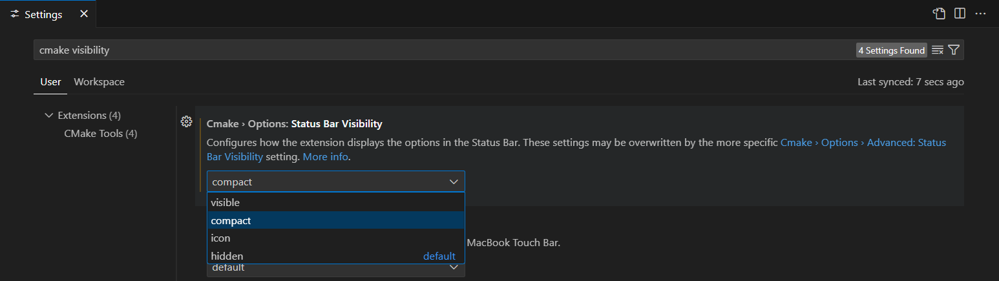
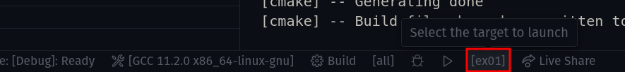

Ce TD est destiné à vous familiariser avec l'environnement de développement et les outils utilisés dans le cadre de ce cours.

Le but est d'**installer** les outils nécessaires pour pouvoir travailler sur vos propres machines.

Je vous invite donc à retourner dans les sections suivantes pour avoir les instructions d'installation :

- [Installer le compilateur](/Lessons/Fundamentals/Setup/Compiler)
- [Visual Studio Code](/Lessons/Fundamentals/Setup/IDE)
- [CMake](/Lessons/Fundamentals/Setup/CMake)

Si vous avez des difficultés à installer, n'hésitez pas à demander à votre chargé de TD ou à moi-même.

## Premier programme

Une fois que vous avez installé les outils, vous pouvez créer votre premier programme.

Je vous invite à regarder la page suivante pour avoir les instructions : [Premier programme](/Lessons/Fundamentals/Setup/HelloImac)

## Plusieurs exécutables

Comme je l'ai expliqué, il ne doit y avoir qu'un seul point d'entrée dans un programme **C++** et donc une seule fonction `main`.

Cependant, dans le cadre des **TDs**, il est parfois utile de pouvoir tester plusieurs fonctions `main` différentes, une par exercice par exemple.

Pour cela, nous allons utiliser une fonctionnalité de CMake qui permet de créer **plusieures targets** ou exécutables.

Je vous invite à créer deux fichiers `td01_ex01.cpp` et `td01_ex02.cpp` dans un dossier `src` et à y mettre le contenu suivant :

```cpp title="src/td01_ex01.cpp"
#include <iostream>

int main()
{
    std::cout << "TD 01 - Ex 01" << std::endl;
    return 0;
}
```

```cpp title="src/td01_ex02.cpp"
#include <iostream>

int main()
{
    std::cout << "TD 01 - Ex 02" << std::endl;
    return 0;
}
```

Ensuite, nous allons créer un fichier `CMakeLists.txt` à la racine du projet avec le contenu suivant :

```cmake title="CMakeLists.txt"
cmake_minimum_required(VERSION 3.10)
set(CMAKE_CXX_STANDARD 17)

project(TD01)

# On indique que l'on veut créer un exécutable "ex01" compilé à partir du fichier td01_ex01.cpp
add_executable(ex01 src/td01_ex01.cpp)

# On indique que l'on veut créer un exécutable "ex02" compilé à partir du fichier td01_ex02.cpp
add_executable(ex02 src/td01_ex02.cpp)
```

Vous devriez avoir une arborescence de fichiers qui ressemble à ça:

```
td01
├── CMakeLists.txt
└── src
    ├── td01_ex01.cpp
    └── td01_ex02.cpp
```

Ouvrez ensuite le dossier `td01` avec VSCode, il devrait vous proposer de configurer CMake comme pour le premier programme.

Pour que CMake vous affiche la liste des différentes targets disponibles, il faut aller changer un paramètre : ouvrez les settings de VSCode, cherchez "cmake visibility" et mettez l'option à "compact" :


Vous devriez ensuite avoir deux targets dans la barre à droite du bouton "Run" en bas :



Cela vous permet de choisir quelle target vous voulez exécuter pour travailler sur plusieurs exécutables dans le même projet.

:::info
C'est la même chose pour les tâches de compilation (à droite du bouton "**Build**").
:::

Bravo, vous êtes maintenant prêt à faire du C++ sur vos propres machines ! 🥳

## Pour aller plus loin avec CMake

Pour en apprendre plus sur CMake, vous pouvez [aller lire ce petit cours sur CMake](https://julesfouchy.github.io/Learn--Clean-Code-With-Cpp/lessons/cmake/) (au moins jusqu'aux sections `Setting your C++ version` et `GLOB`).

Il vous apprendra notamment ce que c'est qu'une *target* dans CMake, et quelles sont les bonnes pratiques autour des targets pour écrire un CMake qui marche bien.

Une fois que vous aurez lu ce cours, vous pouvez reprendre le CMake que vous avez écrit précédemment dans ce TP, et essayer de l'améliorer grâce à ce que vous avez appris. Vous pouvez notamment remplacer le `set(CMAKE_CXX_STANDARD 17)`, et aussi éviter de devoir lister manuellement tous les fichiers .cpp de votre projet (certes vous n'en avez qu'un par target pour l'instant, mais le jour où vous en aurez plusieurs vous serez bien contents de ne pas avoir à tous les lister un par un).